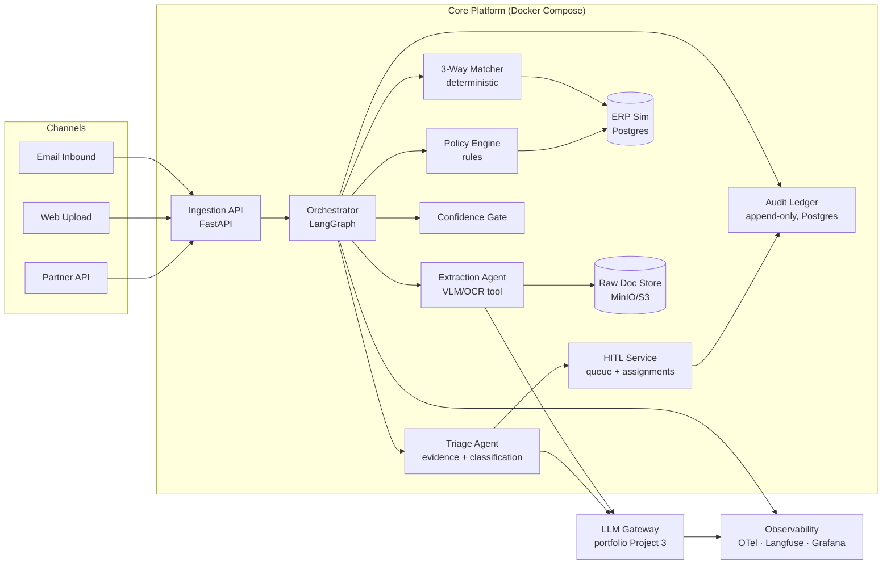
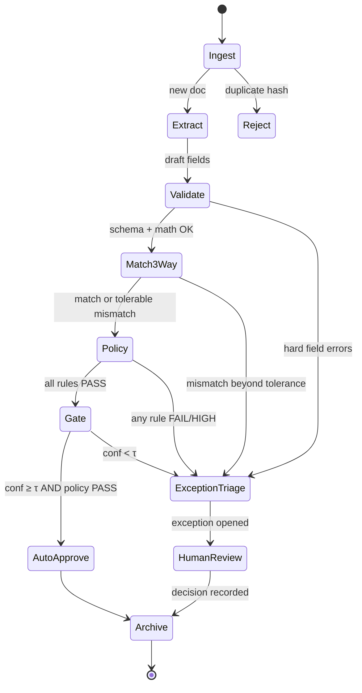

# Architecture — InvoiceOps Agent

Companion to [`../README.md`](../README.md). This document is written the way an ADR-plus-design-doc would be for a real platform team: components, contracts, failure behavior, and the reasoning behind key choices.

---

## 1. Guiding Principles

1. **Determinism at the edges, intelligence in the middle.** Matching, policy, and money-relevant computations are deterministic code. LLMs do extraction, classification, and explanation. An auditor can always recompute the deterministic parts independently.
2. **The LLM never decides alone.** Auto-approval requires *deterministic checks pass* AND *confidence ≥ τ*. Either failing forces human escalation.
3. **Every run is replayable.** Graph state is checkpointed; every external call (model, tool) is logged with versions; the audit ledger is append-only.
4. **The graph is the product.** The pipeline topology — not any single agent — is the reusable reference pattern other S2P use-cases inherit.
5. **Fail loudly, degrade gracefully.** No silent drops: provider outages park runs in `DEGRADED`; low confidence parks invoices in human queues.

---

## 2. High-Level Component View



---

## 3. Orchestration — LangGraph State Machine

### 3.1 Graph topology



### 3.2 Typed graph state (Pydantic v2)

```python
class GraphState(BaseModel):
    run_id: UUID
    invoice_id: str
    doc_ref: S3Ref                      # raw document
    content_hash: str                   # idempotency + dedupe
    model_config: ModelVersions         # pinned model/prompt versions
    extraction: ExtractionResult | None # fields + per-field confidence + bboxes
    validation: list[CheckResult]
    match: MatchResult | None           # line-level deltas vs PO & GR
    policy: list[PolicyOutcome]         # rule id, verdict, severity
    confidence: float | None            # composite gate score
    route: Literal["AUTO", "EXCEPTION", "REJECT"]
    exception: ExceptionRecord | None   # classification, severity, evidence, rec
    human_decision: HumanDecision | None
    checkpoints: list[CheckpointRef]    # LangGraph checkpoint ids
    failures: list[FailureRecord]       # retries, degradations
```

### 3.3 Node responsibilities

| Node | Type | Responsibility | Failure behavior |
|---|---|---|---|
| `Ingest` | code | Hash, dedupe, virus-scan stub, raw-store write, run creation | Duplicate → terminal `Reject`; store failure → retry ×3 w/ backoff, then DLQ |
| `Extract` | agent | VLM/OCR tool call → typed `InvoiceDraft`; per-field confidence; bbox provenance | Provider failover via gateway; low-confidence fields flagged (not failed); total failure → `DEGRADED` park |
| `Validate` | code | Schema, ISO dates, IBAN/checksum, line-math, tax rates, vendor master lookup | Hard errors → `ExceptionTriage` with error catalog |
| `Match3Way` | code | Deterministic invoice↔PO↔GR compare; per-line delta computation; tolerance matrix by field | ERP unavailable → retry; no PO → `MISSING_PO` exception |
| `Policy` | code | Rule set: spend limits, approval matrix, duplicate/near-dup (pgvector cosine over prior invoices), bank-detail change, stale PO. Any `HIGH` severity → forced exception; `CRITICAL` (e.g., duplicate) hard-blocks auto-approval | Rule engine versioned; evaluation errors → fail closed (exception) |
| `Gate` | code | Composite confidence = f(extraction conf, match deltas, policy severity); compare to τ; route | Missing inputs → route to exception (fail safe) |
| `ExceptionTriage` | agent | Assemble evidence package (deltas, docs, history); classify exception type; severity; draft recommendation w/ citations. **Cannot** approve anything | Timeout → basic package without recommendation (still reaches human) |
| `AutoApprove` | code | Payment stub enqueue; ledger write | Idempotent on run_id |
| `HumanReview` | service | Queue mgmt, assignment, SLA timers, notifications; records decision + rationale | — |
| `Archive` | code | Finalize, metrics emit, close run | — |

### 3.4 Durable execution & correctness

- **Checkpointing:** LangGraph checkpointer (Postgres) after every node → crash-safe resume; the `checkpoints` refs are part of the audit trail.
- **Idempotency:** `content_hash` unique index — resubmission returns the existing run; `AutoApprove` and payment-stub calls are idempotent on `run_id`.
- **Retries:** exponential backoff only on *infrastructure* errors; business-rule failures never retry (they're deterministic outcomes).
- **Dead-letter queue** with admin replay UI (out of mock scope, in design).

### 3.5 Confidence gate (design note)

Composite score, not a raw model logit:

```
confidence = w1·min(field_conf)  +  w2·(1 − normalized_match_delta)
           + w3·policy_severity_term
```

- Per-field weights: money fields (amounts, IBAN) dominate; missing low-risk fields (phone) don't tank the score
- τ tuned by eval sweep (see [EVALUATION.md](EVALUATION.md) §5) — published as an ROC-style curve: STP rate vs. missed-anomaly rate as τ varies. Choosing τ is a *business* decision made with data — exactly the conversation this portfolio is designed to provoke in interviews.

---

## 4. ADK Variant & ADR Summary

The same pipeline is implemented a second time using **Google ADK** (hierarchical agents: a coordinator agent with sub-agents for extraction and triage, tools exposed natively). The ADR (`adr/0002-langgraph-vs-adk.md`) compares:

| Dimension | LangGraph | ADK |
|---|---|---|
| Control-flow model | Explicit graph, conditional edges — natural fit for a stateful, regulated workflow | Hierarchical agents; orchestration more implicit |
| Checkpointing / durability | First-class (Postgres checkpointer) | Relies on runtime integration (Vertex/Agent Engine) |
| Observability | LangSmith/OTel mature | Cloud-native tracing; strongest in GCP |
| Portability | Any provider | Best on Google Cloud |
| **Verdict for this use-case** | **Primary implementation** — auditable state machine is the requirement | Variant + reference for GCP-native deployments |

This demonstrates the JD's "model/orchestration selection" competency — the reasoning, not the framework, is the deliverable.

---

## 5. API Design (FastAPI, async)

| Method | Path | Purpose | Auth (demo: stubbed) |
|---|---|---|---|
| `POST` | `/v1/invoices` | Upload push channel (multipart or JSON+ref) | service token |
| `POST` | `/v1/invoices/email-webhook` | Inbound email webhook | HMAC sig |
| `GET` | `/v1/invoices` | List/filter queue (status, assignee, severity, aging) | user JWT |
| `GET` | `/v1/invoices/{id}` | Full aggregate (extraction, match, policy, exception) | RBAC |
| `GET` | `/v1/runs/{run_id}/trace` | Node-by-node trace w/ spans, versions, costs | RBAC |
| `GET` | `/v1/invoices/{id}/provenance` | Point-in-time decision provenance package | audit role |
| `POST` | `/v1/exceptions/{id}/decision` | `{action, rationale, reason_code}` → ledger | user JWT + four-eyes rule check |
| `GET` | `/v1/metrics` | Prometheus exposition | scrape |
| `GET` | `/healthz` `/readyz` | Liveness / readiness | — |

Conventions: Pydantic response models everywhere; RFC 7807 problem+json errors; request IDs propagate into traces; idempotency-key header honored on POSTs.

---

## 6. Data Model (PostgreSQL)

```
vendors(vendor_id PK, name, tax_id, bank_details, risk_flags, …)
purchase_orders(po_id PK, vendor_id FK, currency, status, lines JSONB, …)
goods_receipts(gr_id PK, po_id FK, received_qty JSONB, …)
invoices(invoice_id PK, vendor_id FK, content_hash UNIQUE, doc_ref,
         status, amount_total, …)
invoice_lines(invoice_id FK, line_no, description, qty, unit_price, tax_code, …)
runs(run_id PK, invoice_id FK, graph_version, model_versions JSONB,
     route, confidence, started_at, finished_at, status)
checkpoints(cp_id PK, run_id FK, node, state_snapshot JSONB, created_at)
ledger(entry_id PK BIGSERIAL, run_id FK, seq, actor_type
       ∈ {SYSTEM, AGENT, HUMAN, POLICY}, event JSONB, model_versions,
       policy_version, prompt_template_version, created_at)        -- append-only
exceptions(exception_id PK, invoice_id FK, run_id FK, type, severity,
           evidence JSONB, recommendation JSONB, assignee, sla_due_at)
decisions(decision_id PK, exception_id FK, actor_user, action,
          rationale, reason_code, created_at)                      -- append-only
```

Notes: ledger and decisions are **append-only** (no UPDATE/UPDATE grants; triggers enforce); `model_versions`/`prompt_template_version`/`policy_version` on every entry give point-in-time provenance; near-duplicate detection uses pgvector embeddings over normalized invoice content.

---

## 7. LLM Gateway Integration (portfolio Project 3)

All model calls go through the gateway — never direct provider SDKs:

- **Routing:** extraction → vision-capable model class; triage → reasoning model class; data-sensitivity tier (this demo: synthetic, tier-0) selects hosted vs. local open-weights endpoint
- **Guardrails in-path:** PII redaction on inputs, prompt-injection heuristics on document text, output schema validation before the graph sees a response
- **Cost control:** semantic cache keyed on normalized doc content (safe: extraction is deterministic-ish across identical docs); token budgets per run; fallback chain
- **Telemetry:** per-call cost/latency/token spans feed Grafana and the eval reports

---

## 8. Observability

| Signal | Implementation |
|---|---|
| Distributed traces | OpenTelemetry spans per graph node + per tool/model call; run_id as correlation id |
| LLM-specific traces | Langfuse: prompt/completion pairs, template versions, costs, per-field extraction confidence |
| Metrics | Prometheus: `invoices_processed_total{route}`, `stp_rate`, `exception_queue_depth`, `extract_field_conf_hist`, `run_latency_p95`, `cost_per_invoice`, `provider_failovers_total` |
| Dashboards (Grafana) | Ops overview · cost & latency · quality (conf distributions, escalation funnel) · queue/SLA aging |
| Alerts | p95 latency breach, queue age > SLA, provider error-rate spike, eval-drift warning on live confidence distribution |
| Log discipline | Structured JSON logs; no PII beyond references; every log line carries run_id |

---

## 9. Testing Strategy

| Layer | What | Tooling |
|---|---|---|
| Unit | Matchers, policy rules, gate math, tax/line math | pytest, hypothesis (property tests on math) |
| Integration | Graph happy/exception paths against real Postgres + recorded LLM responses | pytest + testcontainers; VCR-style model cassettes for determinism |
| Contract | API schemas, ledger append semantics | schemathesis |
| **Eval** | End-to-end on golden dataset — the release gate | custom runner, see [EVALUATION.md](EVALUATION.md) |
| Chaos (stretch) | Provider outage → failover; crash mid-graph → resume from checkpoint | toxiproxy-style stubs |

CI order: ruff/mypy → unit → integration → **eval gate** → image build. The eval gate failing blocks merge; PR comment shows metric deltas vs. main.

---

## 10. Deployment (Docker Compose, demo-scale)

Services: `api` (FastAPI/uvicorn) · `worker` (graph executor) · `postgres` (ERP sim + ledger + checkpoints) · `minio` (raw docs) · `gateway` (Project 3) · `langfuse` · `grafana` + `prometheus` · `seed` (one-shot synthetic data loader).

One command (`docker compose up`) brings the whole platform up with seeded vendors/POs/GRs and sample invoices — the README's "how to run" section is a first-class demo asset. Cloud-native variant notes (ECS/Cloud Run, managed PG, secrets) are documented for the "cloud architectures" JD bullet.

---

## 11. Cross-Cutting Decisions (ADR index)

| ADR | Decision |
|---|---|
| 0001 | Deterministic matcher/policy instead of LLM-judged matching |
| 0002 | LangGraph primary, ADK variant — with comparison |
| 0003 | Confidence gate as composite score; abstention over guessing |
| 0004 | Append-only ledger with point-in-time version pinning |
| 0005 | All model traffic through the LLM Gateway (no direct SDK calls) |
| 0006 | Synthetic data with injected anomalies; published prevalence assumptions |
| 0007 | VCR-style recorded LLM responses in integration tests for determinism |
